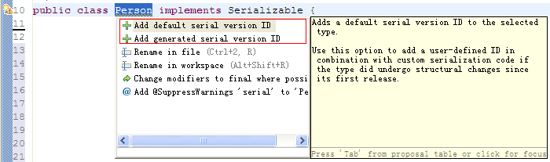

## 概念
序列化：将对象转化为字节序列

反序列化：将字节序列恢复为对象

## 用途

* 把对象的字节序列永久地保存到硬盘上，通常存放在一个文件中；

*  在网络上传送对象的字节序列。

<!--more-->

在很多应用中，需要对某些对象进行序列化，让它们离开内存空间，入住物理硬盘，以便长期保存。比如最常见的是Web服务器中的Session对象，当有 10万用户并发访问，就有可能出现10万个Session对象，内存可能吃不消，于是Web容器就会把一些seesion先序列化到硬盘中，等要用了，再把保存在硬盘中的对象还原到内存中。

当两个进程在进行远程通信时，彼此可以发送各种类型的数据。无论是何种类型的数据，都会以二进制序列的形式在网络上传送。发送方需要把这个Java对象转换为字节序列，才能在网络上传送；接收方则需要把字节序列再恢复为Java对象。

## 序列化API

java.io.ObjectOutputStream代表对象输出流，它的writeObject(Object obj)方法可对参数指定的obj对象进行序列化，把得到的字节序列写到一个目标输出流中。

java.io.ObjectInputStream代表对象输入流，它的readObject()方法从一个源输入流中读取字节序列，再把它们反序列化为一个对象，并将其返回。

只有实现了Serializable和Externalizable接口的类的对象才能被序列化。Externalizable接口继承自 Serializable接口，实现Externalizable接口的类完全由自身来控制序列化的行为，而仅实现Serializable接口的类可以 采用默认的序列化方式 。

对象序列化包括如下步骤：

* 1) 创建一个对象输出流，它可以包装一个其他类型的目标输出流，如文件输出流；

* 2） 通过对象输出流的writeObject()方法写对象。

对象反序列化的步骤如下：
* 1） 创建一个对象输入流，它可以包装一个其他类型的源输入流，如文件输入流；

* 2） 通过对象输入流的readObject()方法读取对象。

## 范例：

#### 定义一个Person类，实现Serializable接口

```
package Serialize;

import java.io.Serializable;

public class Person implements Serializable {
	//private static final long serialVersionUID = -6802256731316734610L;
    private int age;
    private String name;
    private String sex;
   // private String height;

	public int getAge() {
		return age;
	}
	public void setAge(int age) {
		this.age = age;
	}
	public String getName() {
		return name;
	}
	public void setName(String name) {
		this.name = name;
	}
	public String getSex() {
		return sex;
	}
	public void setSex(String sex) {
		this.sex = sex;
	}
//	public String getHeight() {
//		return height;
//	}
//	public void setHeight(String height) {
//		this.height = height;
//	}

}
```
#### 序列化和反序列化Person类对象

*  序列化

```
package Serialize;

import java.io.File;
import java.io.FileInputStream;
import java.io.FileNotFoundException;
import java.io.FileOutputStream;
import java.io.IOException;
import java.io.ObjectInputStream;
import java.io.ObjectOutputStream;
import java.text.MessageFormat;

public class Serialize {
    public static void serializePerson() throws FileNotFoundException, IOException{
    	  Person person=new Person();
    	  person.setAge(23);
    	  person.setName("xu");
        person.setSex("male");
        ObjectOutputStream oo=new ObjectOutputStream(new FileOutputStream(new File("/Users/ics/Desktop/Person.txt")));
        oo.writeObject(person);
        System.out.println("序列化对象成功");
        oo.close();
    }


  public static void main(String args[]) throws FileNotFoundException, IOException, ClassNotFoundException{
	  serializePerson();
  }
}
```

 * 反序列化

```
package Serialize;

import java.io.File;
import java.io.FileInputStream;
import java.io.FileNotFoundException;
import java.io.IOException;
import java.io.ObjectInputStream;

public class deserialize {
	public static Person deserializePerson() throws FileNotFoundException, IOException, ClassNotFoundException {
		ObjectInputStream in = new ObjectInputStream(new FileInputStream(new File("/Users/ics/Desktop/Person.txt")));
		Person person = (Person)in.readObject();
		System.out.println("反序列化成功");
		in.close();
		return person;

	}

	public static void main(String args[]) throws FileNotFoundException, ClassNotFoundException, IOException {
		Person person = deserializePerson();
		System.out.println(person.getName()+person.getSex()+person.getAge());

	}

}
```
序列化成功后就在桌面生成了了Person.txt文件。反序列化就是读取这个文件生成一个Person对象。

*注意点*

* Person类必须声明实现 java.io.Serializable 接口
* Person类的包结构必须相同，即*相同的包，相同的结构*，这里序列化和反序列化虽然不在一个项目，但一定要有相同的包名`package Serialize`，不同项目下的Person类如果没有设置serialVersionUID，则也要有完全相同的结构。


## serialVersionUID的作用

s​e​r​i​a​l​V​e​r​s​i​o​n​U​I​D​:​ ​字​面​意​思​上​是​序​列​化​的​版​本​号​，凡是实现Serializable接口的类都有一个表示序列化版本标识符的静态变量


serialVersionUID有两种生成方式,用鼠标点击警告框如下



(1)采用 Add defalut serial version ID 这种方式生成的serialVersionUID是1L，例如

```
1 private static final long serialVersionUID = 1L;
```


(2)采用 Add generated serial version ID 这种方式生成的serialVersionUID是根据类名，接口名，方法和属性等来生成的，例如

```
1 private static final long serialVersionUID = 4603642343377807741L;
```

在反序列的时候，如果我在Person类中添加一个字段Height,如下

```
package Serialize;


import java.io.Serializable;

public class Person implements Serializable {

  //private static final long serialVersionUID = -6802256731316734610L;
    private int age;
    private String name;
    private String sex;
    private String height;

	public int getAge() {
		return age;
	}
	public void setAge(int age) {
		this.age = age;
	}
	public String getName() {
		return name;
	}
	public void setName(String name) {
		this.name = name;
	}
	public String getSex() {
		return sex;
	}
	public void setSex(String sex) {
		this.sex = sex;
	}
	public String getHeight() {
		return height;
	}
	public void setHeight(String height) {
		this.height = height;
	}

}
```

这时候对文件反序列化的时候，会出现如下错误

```
Exception in thread "main" java.io.InvalidClassException: Serialize.Person; local class incompatible: stream classdesc serialVersionUID = -6802256731316734610, local class serialVersionUID = -1407662779786941705
```
意思就是说，文件流中的class和classpath中的class，也就是修改过后的class，不兼容了，处于安全机制考虑，程序抛出了错误，并且拒绝载入.那么如果我们真的有需求要在序列化后添加一个字段或者方法呢？应该怎么办？那就是自己去指定serialVersionUID。将上面代码中的serialVersionUID取消注释，使新老版本的Person类中serialVersionUID值完全相等，就不会出现错误了。

类的serialVersionUID的默认值完全依赖于Java编译器的实现，对于同一个类，用不同的Java编译器编译，有可能会导致不同的 serialVersionUID，也有可能相同。为了提高serialVersionUID的独立性和确定性，强烈建议在一个可序列化类中显示的定义serialVersionUID，为它赋予明确的值。

显式地定义serialVersionUID有两种用途：

*　1、 在某些场合，希望类的不同版本对序列化兼容，因此需要确保类的不同版本具有相同的serialVersionUID；

*　2、 在某些场合，不希望类的不同版本对序列化兼容，因此需要确保类的不同版本具有不同的serialVersionUID。
