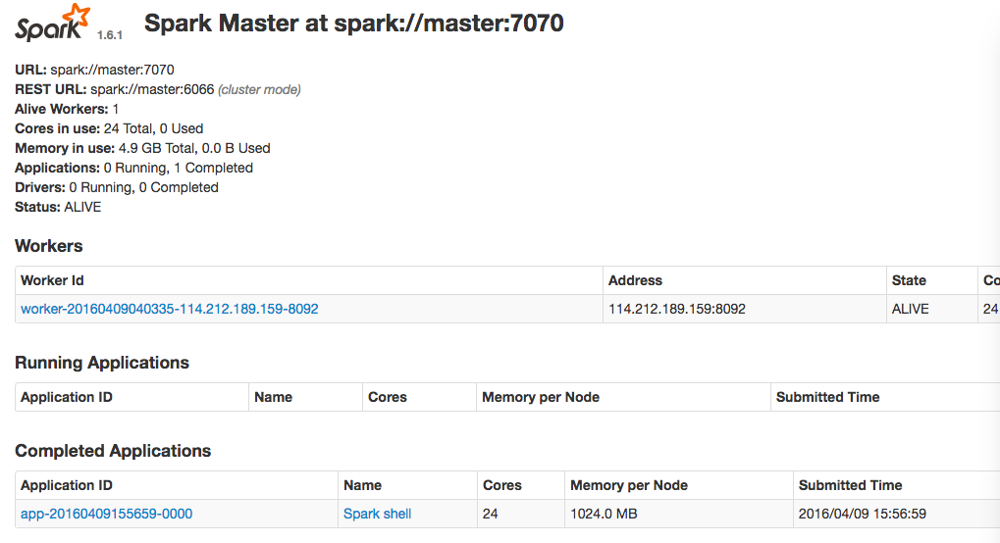

## Spark是什么

Apache Spark是一个新兴的大处理处理通用引擎，提供了分布式的内存抽象，适用于包括批处理、迭代算法、交互式查询、流处理等场景。spark扩展了广泛使用的MapReduce计算模型，而且高效的支持更多计算模式。Spark的一个主要特点就是能够在内存中进行计算，因而更快。不过即使是必须在磁盘上进行的复杂计算，Spark也比MapReduce更加高效。

<!--more-->

## 安装Spark

[官网下载地址](http://spark.apache.org/downloads.html)，选择与hadoop对应的版本。

下载后找到spark目录下的conf/目录，执行如下命令将spark-env.sh.template和slaves.template各拷贝一份出来，分别命名为spark-env.sh和slaves
```
cp ./conf/spark-env.sh.template ./conf/spark-env.sh
cp ./conf/slaves.template ./conf/slaves
```
编辑spark-env.sh文件，加入如下几行
```
export SCALA_HOME=/home/hadoop/scala  
export JAVA_HOME=/usr/share/jdk1.8.0_60
export MASTER=spark://master:7070
export SPARK_MASTER_INSTANCES=1
export SPARK_MASTER_IP=master
export SPARK_MASTER_PORT=7070
export SPARK_MASTER_WEBUI_PORT=8090
export SPARK_WORKER_PORT=8092
export SPARK_WORKER_MEMORY=5000m
```
注意：这里设置SCALA_HOME的目的是为了使用spark-shell,SPARK_MASTER_IP的值是主节点的ip地址，MASTER和SPARK_MASTER_PORT的值必须相等，设置了MASTER之后，就可以不用再在spark-submit部署应用时添加--master字段

编辑slaves文件，将localhost改成你从节点的ip地址或者名称列表，我这里只有一个从节点就改成slave1。

本机环境搭建完成后将这个环境拷贝到从节点。
```
scp -r /home/hadoop/spark slave1:/home/hadoop/spark
```
在/etc/profile中将Spark加入全局环境
```
export SPARK_HOME=/home/hadoop/spark
export PATH=$SPARK_HOME/bin:$PATH
```
最后就可以在spark的sbin目录下启动spark。
```
./start-all.sh
```
效果如图



## Spark运行模式

Spark有以下四种运行模式：

* local：本地单进程模式，用于本地开发测试Spark代码

* standalone：分布式集群模式，Master-Worker架构，Master负责调度，Worker负责具体Task的执行

* on yarn/mesos：运行在yarn/mesos等资源管理框架之上，yarn/mesos提供资源管理，spark提供计算调度，并可与其他计算框架(如MapReduce/MPI/Storm)共同运行在同一个集群之上

* on cloud(EC2)：运行在AWS的EC2之上

## Spark部署

Spark常用的部署方式

常见语法
```
./bin/spark-submit \
  --class <main-class>
  --master <master-url> \
  --deploy-mode <deploy-mode> \
  --conf <key>=<value> \
  ... # other options
  <application-jar> \
  [application-arguments]
```
不同运行模式下的几种部署方式

```
# Run application locally on 8 cores
./bin/spark-submit \
  --class org.apache.spark.examples.SparkPi \
  --master local[8] \
  /path/to/examples.jar \
  100

# Run on a Spark Standalone cluster in client deploy mode
./bin/spark-submit \
  --class org.apache.spark.examples.SparkPi \
  --master spark://207.184.161.138:7077 \
  --executor-memory 20G \
  --total-executor-cores 100 \
  /path/to/examples.jar \
  1

# Run on a Spark Standalone cluster in cluster deploy mode with supervise
./bin/spark-submit \
  --class org.apache.spark.examples.SparkPi \
  --master spark://207.184.161.138:7077 \
  --deploy-mode cluster
  --supervise
  --executor-memory 20G \
  --total-executor-cores 100 \
  /path/to/examples.jar \
  1

# Run on a YARN cluster
export HADOOP_CONF_DIR=XXX
./bin/spark-submit \
  --class org.apache.spark.examples.SparkPi \
  --master yarn-cluster \  # can also be `yarn-client` for client mode
  --executor-memory 20G \
  --num-executors 50 \
  /path/to/examples.jar \
  1

# Run a Python application on a Spark Standalone cluster
./bin/spark-submit \
  --master spark://207.184.161.138:7077 \
  examples/src/main/python/pi.py \
  1
```


重要参数说明

--class 主类 格式：包名.类名

--master

* 对于standalone模式，是spark://ip:port/的形式

* 对于yarn，有yarn-cluster与yarn-cluster2种

* 对于mesos，目前只有client选项

* 除此之外，还有local[N]这种用于本地调试的选项

—-deploy-mode:client和cluster2种模式

—-conf:指定key=value形式的配置

例子：
```
spark-submit --deploy-mode client \
             --class decisiontree.decisiontree \
             --master spark:master:7070 \
             --executor-memory 2G \
             --num-executors 3 \
             /home/hadoop/decisiontree.jar \
             /input \          //默认是HDFS上的文件
             /output      
```

## Spark Shell交互分析

Spark使用Spark shell提供交互的方式来分析数据，Spark Shell支持Scala，Python和R对应的启动脚本分别为
```
./bin/spark-shell
./bin/pyspark
./bin/sparkR
```
注意：如果设置了 HADOOP_CONF_DIR 环境变量，则shell中默认为hdfs://上的文件，要指明本地文件路径，用file：//<path>

## 常见错误
```
java.io.EOFException: End of File Exception between local host is: "master/114.212.84.5"; destination host is: "master":9000; : java.io.EOFException; For more details see:  http://wiki.apache.org/hadoop/EOFException
```
spark和hdfs版本不一致。
