LDA的全称是Linear Discriminant Analysis（线性判别分析），有些资料上也称为是Fisher’s Linear Discriminant，因为它被Ronald Fisher发明自1936年，它是一种监督学习方法。

<!--more-->

## 二类情况

LDA的原理是，将带上标签的数据（点），通过投影的方法，投影到维度更低的空间中，使得投影后的点，会形成按类别区分，一簇一簇的情况，相同类别的点，将会在投影后的空间中更接近。

这里只讨论二分类的情况，也就是y=1或者y=0。现在我们觉得原始特征数太多，想将d维特征降到只有一维，而又要保证类别能够“清晰”地反映在低维数据上，也就是这一维就能决定每个样例的类别。

我们将这个最佳的向量称为w（d维），那么样例x（d维）到w上的投影可以用下式来计算

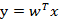

这里得到的y值不是0/1值，而是x投影到直线上的点到原点的距离。

当x是二维的，我们就是要找一条直线（方向为w）来做投影，然后寻找最能使样本点分离的直线。如下图：

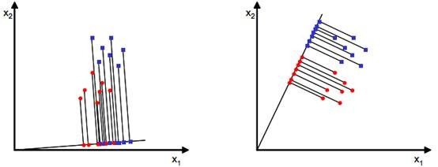

从直观上来看，右图比较好，可以很好地将不同类别的样本点分离。

接下来我们从定量的角度来找到这个最佳的w。

首先我们寻找每类样例的均值（中心点），这里i只有两个

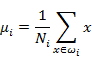

由于x到w投影后的样本点均值为

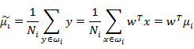

由此可知，投影后的的均值也就是样本中心点的投影。

什么是最佳的直线（w）呢？我们首先发现，能够使投影后的两类样本中心点尽量分离的直线是好的直线，定量表示就是：

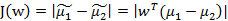

J(w)越大越好。

但是只考虑J(w)行不行呢？不行，看下图

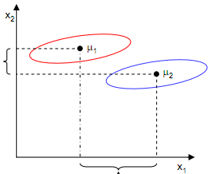

样本点均匀分布在椭圆里，投影到横轴x1上时能够获得更大的中心点间距J(w)，但是由于有重叠，x1不能分离样本点。投影到纵轴x2上，虽然J(w)较小，但是能够分离样本点。因此我们还需要考虑样本点之间的方差，方差越大，样本点越难以分离。

我们使用另外一个度量值，称作散列值（scatter），对投影后的类求散列值，如下

从公式中可以看出，只是少除以样本数量的方差值，散列值的几何意义是样本点的密集程度，值越大，越分散，反之，越集中。

而我们想要的投影后的样本点的样子是：不同类别的样本点越分开越好，同类的越聚集越好，也就是均值差越大越好，散列值越小越好。正好，我们可以使用J(w)和S来度量，最终的度量公式是

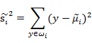

先把散列值公式展开

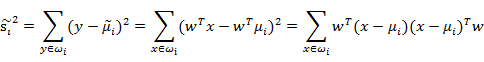

我们定义上式中中间那部分

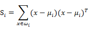

这个公式的样子不就是少除以样例数的协方差矩阵么，称为散列矩阵（scatter matrices）

我们继续定义

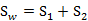

称为Within-class scatter matrix。

替代分母中的部分得到

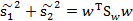

然后，我们展开分子

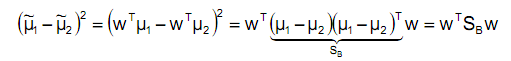

称为Between-class scatter，是两个向量的外积，虽然是个矩阵，但秩为1。

那么J(w)最终可以表示为

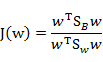

这就是LDA最大化的目标，即和的“广义瑞利商”

在我们求导之前，需要对分母进行归一化，因为不做归一的话，w扩大任何倍，都成立，我们就无法确定w。因此我们打算令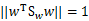，那么加入拉格朗日乘子后，求导

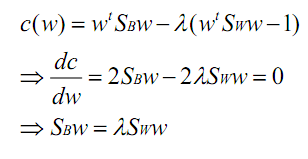

其中用到了矩阵微积分，求导时可以简单地把当做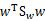看待

如果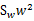可逆，那么将求导后的结果两边都乘以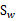，得

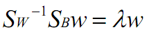

这个可喜的结果就是，w是矩阵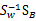的特征向量。

这个公式称为Fisher linear discrimination。

等等，让我们再观察一下，发现前面的公式

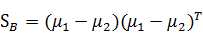

那么

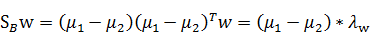

 代入最后的特征值公式得

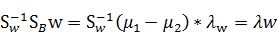

由于对w扩大缩小任何倍不影响结果，因此可以约去两边的未知常数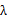和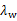，得到

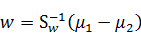

 至此，我们只需要求出原始样本的均值和方差就可以求出最佳的方向w，这就是Fisher于1936年提出的线性判别分析。

 看上面二维样本的投影结果图：

 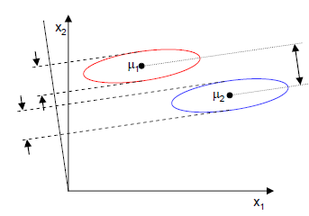

 ## 多类情况

 前面是针对只有两个类的情况，假设类别变成多个了，那么要怎么改变，才能保证投影后类别能够分离呢？

 我们之前讨论的是如何将d维降到一维，现在类别多了，一维可能已经不能满足要求。假设我们有C个类别，需要K维向量（或者叫做基向量）来做投影。

 将这K维向量表示为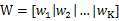

 我们将样本点在这K维向量投影后结果表示为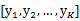，有以下公式成立

 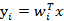

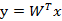

为了像上节一样度量J(w)，我们打算仍然从类间散列度和类内散列度来考虑。

当样本是二维时，我们从几何意义上考虑：

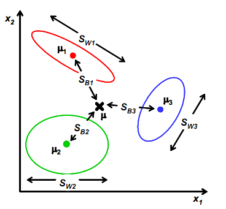

其中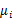，与上节的意义一样，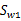是类别1里的样本点相对于该类中心点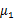的散列程度。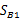变成类别1中心点相对于样本中心点的协方差矩阵，即类1相对于的散列程度。

为

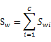

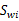的计算公式不变，仍然类似于类内部样本点的协方差矩阵

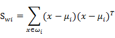

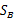需要变，原来度量的是两个均值点的散列情况，现在度量的是每类均值点相对于样本中心的散列情况。类似于将看作样本点，是均值的协方差矩阵，如果某类里面的样本点较多，那么其权重稍大，权重用Ni/N表示，但由于J(w)对倍数不敏感，因此使用Ni。

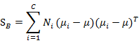

其中

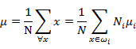

是所有样本的均值。

上面讨论的都是在投影前的公式变化，但真正的J(w)的分子分母都是在投影后计算的。下面我们看样本点投影后的公式改变：

 这两个是第i类样本点在某基向量上投影后的均值计算公式。

 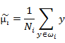

 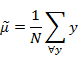

  下面两个是在某基向量上投影后的和

  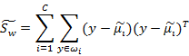

  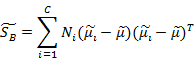

   其实就是将换成了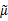。

综合各个投影向量（w）上的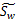和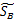，更新这两个参数，得到

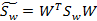

W是基向量矩阵，是投影后的各个类内部的散列矩阵之和，是投影后各个类中心相对于全样本中心投影的散列矩阵之和。

回想我们上节的公式J(w)，分子是两类中心距，分母是每个类自己的散列度。现在投影方向是多维了（好几条直线），分子需要做一些改变，我们不是求两两样本中心距之和（这个对描述类别间的分散程度没有用），而是求每类中心相对于全样本中心的散列度之和。

然而，最后的J(w)的形式是

由于我们得到的分子分母都是散列矩阵，要将矩阵变成实数，需要取行列式。又因为行列式的值实际上是矩阵特征值的积，一个特征值可以表示在该特征向量上的发散程度。因此我们使用行列式来计算（此处我感觉有点牵强，道理不是那么有说服力）。

整个问题又回归为求J(w)的最大值了，我们固定分母为1，然后求导，得出最后结果（我翻查了很多讲义和文章，没有找到求导的过程）

与上节得出的结论一样

最后还归结到了求矩阵的特征值上来了。首先求出的特征值，然后取前K个特征向量组成W矩阵即可。

注意：由于中的秩为1，因此的秩至多为C（矩阵的秩小于等于各个相加矩阵的秩的和）。由于知道了前C-1个后，最后一个可以有前面的来线性表示，因此的秩至多为C-1。那么K最大为C-1，即特征向量最多有C-1个。特征值大的对应的特征向量分割性能最好。

由于不一定是对称阵，因此得到的K个特征向量不一定正交，这也是与PCA不同的地方。
