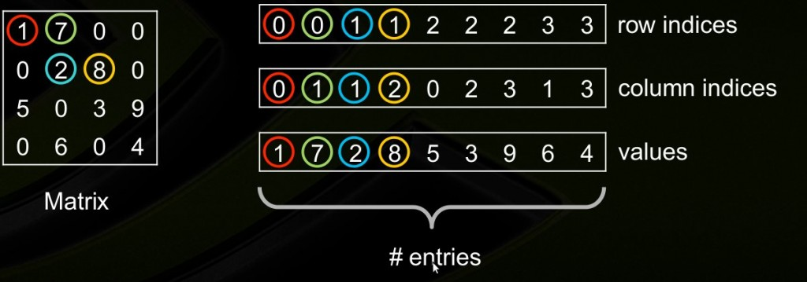
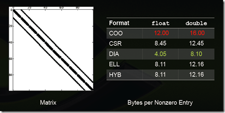

对于很多元素为零的稀疏矩阵，仅存储非零元素可使矩阵操作效率更高。现有许多种稀疏矩阵的存储方式，但是多数采用相同的基本技术，他们的核心思想是存储矩阵所有的非零元素到一个线性数组中，并提供辅助数组来描述原数组中非零元素的位置。

<!--more-->
几种常见的稀疏矩阵存储格式：

## Dictionary Of  Keys(DOK)

以字典的方式（如hash table等）存储键值对（（row,column）, value）。这种方法对增量构造稀疏矩阵非常有效，但是对于有序的检索、迭代元素效果不佳。​

## List Of Lists[LIL]

每一行使用一个list来进行存储以下资料（column_index, value）

（column_index是指该元素在这一行中的第几个元素），同样是对增量构造稀疏矩阵有效， 而且通常这些元素是根据column_index进行排序以支持有效快速的查询。

## Coordinate Format(COO)

仅存储非零元素以及每个非零元素的坐标。按行列值的方式存。元素是按照先row后column的顺序排列，以支持快速的随机访问。

这种存储方式的主要优点是灵活、简单。

## Diagonal Storage Format(DIA)

按对角线方式存，列代表对角线，行代表行。省略全零的对角线。(从左下往右上开始：第一个对角线是零忽略，第二个对角线是5，6，第三个对角线是零忽略，第四个对角线是1，2，3，4，第五个对角线是7，8，第六第七个对角线忽略)

## Compressed Sparse Row Format (CSR)&Compressed Sparse Column Format (CSC)

CSR矩阵格式通过用三个一维的数组来存储一个m×n的矩阵M。定义NNZ（Num-non-zero）为矩阵M中非0元素的个数.

第一个数组为values数组。其中，values数组的长度为NNZ，分别从从左到右从上到下的非零元素的值。

第二个数组为column数组。其中，column数组的长度为NNZ，其对应于values数组中的元素的column_index（例如元素8排列在所在行的第3个位置,因此其column index为2）。

第三个数组为row offsets，其中row offsets的数组大小为m+1，其前m个元素分别代表这每一行中第一个非零元素在Values数组的下标。（例如元素2是第二行的第二个元素，其在values数组中的下标为2.）

在上面我们惊奇的发现，使用CSR存储方式后，所使用的内存反而增加了。事实上，要满足NNZ<(m(n−1)−1)/2的时候，才会节省内存空间。

CSR（Compressed Sparse Row）的名字由来因为，CSR与COO相比，压缩了行（rowIndex）的信息。CSC和CSR类似，只不过和CSR行列互换。values数组里是按列存的数值，row offsets变成了col offsets，column数组变成了row数组。

## ELLPACK (ELL)

用两个和原始矩阵相同行数的矩阵来存：第一个矩阵存的是列号，第二个矩阵存的是数值，行号就不存了，用自身所在的行来表示；这两个矩阵每一行都是从头开始放，如果没有元素了就用个标志比如*结束。上图中间矩阵有误，第三行应该是  0 2 3。

## Hybrid (HYB) ELL + COO

如果某一行很多元素，那么ELL后面两个矩阵就会很胖，,为了解决（3）ELL中提到的，如果某一行特别多，造成其他行的浪费，那么把这些多出来的元素（比如第三行的9，其他每一行最大都是2个元素）用COO单独存储。

稀疏矩阵的存储方式可以根据功能分为两大类：

* 支持有效的更改，查询（如DOK，LIL，COO）

* 支持有效的矩阵运算，操作。（如CSR，CSC等）

选择稀疏矩阵存储格式的一些经验：

* DIA和ELL格式在进行稀疏矩阵-矢量乘积(sparse matrix-vector products)时效率最高，所以它们是应用迭代法(如共轭梯度法)解稀疏线性系统最快的格式；

* COO和CSR格式比起DIA和ELL来，更加灵活，易于操作；

* ELL的优点是快速，而COO优点是灵活，二者结合后的HYB格式是一种不错的稀疏矩阵表示格式；

* 根据Nathan Bell的工作，CSR格式在存储稀疏矩阵时非零元素平均使用的字节数(Bytes per Nonzero Entry)最为稳定（float类型约为8.5，double类型约为12.5），而DIA格式存储数据的非零元素平均使用的字节数与矩阵类型有较大关系，适合于StructuredMesh结构的稀疏矩阵（float类型约为4.05，double类型约为8.10），对于Unstructured Mesh以及Random Matrix,DIA格式使用的字节数是CSR格式的十几倍；

* COO格式常用于从文件中进行稀疏矩阵的读写，如matrix market即采用COO格式，而CSR格式常用于读入数据后进行稀疏矩阵计算。

一些特殊类型矩阵的存储效率（数值越小说明压缩率越高，即存储效率越高）:

Structured Mesh

Unstructured Mesh

Random matrix

Power-Law Graph

格式适用性总结：

