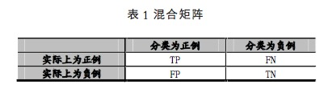
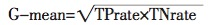
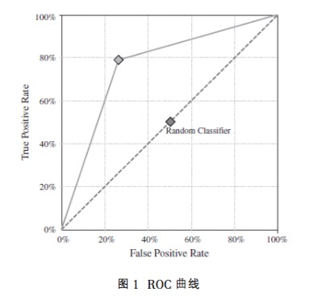

## 概念

类别数据不均衡是分类任务中一个典型的存在的问题。简而言之，即数据集中，每个类别下的样本数目相差很大。例如，在一个二分类问题中，共有100个样本（100行数据，每一行数据为一个样本的表征），其中80个样本属于class 1，其余的20个样本属于class 2，class 1:class2=80:20=4:1，这便属于类别不均衡。当然，类别不均衡问同样会发生在多分类任务中。它们的解决方法是一样的。

<!--more-->

现实中有很多类别不均衡问题，它是常见的，并且也是合理的，符合人们期望的。如，在欺诈交易识别中，属于欺诈交易的应该是很少部分，即绝大部分交易是正常的，只有极少部分的交易属于欺诈交易。这就是一个正常的类别不均衡问题。又如，在客户流失的数据集中，绝大部分的客户是会继续享受其服务的（非流失对象），只有极少数部分的客户不会再继续享受其服务（流失对象）。一般而已，如果类别不平衡比例超过4:1，那么其分类器会大大地因为数据不平衡性而无法满足分类要求的。因此在构建分类模型之前，需要对分类不均衡性问题进行处理。

## 解决方案
迄今为止 , 解决不平衡分类问题的策略可以分 为两大类 .一类是从训练集入手 , 通过改变训练集样本分布 ,降低不平衡程度 .另一类是从学习算法入手 , 根据算法在解决不平衡问题时的缺陷 , 适当地修改算法使之适应不平衡分类问题 .平衡训练集的方法主要有训练集重采样 (re-sampling)方法和训练集划分方法 .学习算法层面的策略包括分类器集成 、代价敏感学习和特征选择方法等 .

### 数据层面

#### 重采样

重采样方法是通过增加稀有类训练样本数的上采样 (up-sampling)和减少大类样本数的下采样（down-samplings)使不平衡的样本分布变得比较平衡，从而提高分类器对稀有类的识别率 .

##### 上采样

最原始的上采样方法是复制稀有类的样本 , 但是这样做容易导致过学习, 并且对提高稀有类识 别率没有太大帮助  .较高级的上采样方法则采用一些启发式技巧 , 有选择地复制稀有类样本 , 或者生成新的稀有类样本。Chawla等人提出的SMOTE算法是一种简单有效的上采样方法，该方法首先为每个稀有类样本随机选出几个邻近样本，并且在该样本与这些邻近的样本的连线上随机取点，生成无重复的新的稀有类样本。还有一些其他的方法，如添加随机噪声，还有一些其他的研究，具体可以看相关论文。

这里有SMOTE算法的多个不同语言的实现版本：
* Python: [UnbalancedDataset](https://github.com/scikit-learn-contrib/imbalanced-learn)模块提供了SMOTE算法的多种不同实现版本，以及多种重采样算法。
* R: [DMwR package](https://cran.r-project.org/web/packages/DMwR/DMwR.pdf)。
* Weka: [SMOTE supervised filter](http://weka.sourceforge.net/doc.packages/SMOTE/weka/filters/supervised/instance/SMOTE.html)。

##### 下采样
下采样通过舍弃部分大类样本的方法 , 降低不平衡程度 .Kubat和Matwin[Addressing the Curse of Imbalanced Training Sets: One-Sided Selection]()采用单边采样方式,去除大类中的噪音样本 、边界样本和冗余样本 .Chen等人[Pruning support vectors for imbalanced data classification]()则通过修剪大类的支持向量，达到平衡支持向量个数的目的,从而提高稀有类的识别率 .Raskutti和Kowalczyk[Raskutti B, Kowalczyk A. Extreme Re-balancing for SVMs: A Case Study. ]()同时考虑上采样和下采样 , 并且扩展到一类学习 , 即只采用一类的样本作为训练集 , 因此不存在不平衡分类问题 .Estabroks和Japkowic[A Mixture-of-Experts Framework for Learning from Imbalanced Data Sets]()同时采用上采样和下采样以及不同的采样率,获得大量的子分类器 , 并使用混合专家
(mixture-of-experts)学习框架将这些子分类器集成 . 他们的结果显示,这种方法比普通的 AdaBost有更好的分类效果 , 但并不清楚到底是上采样还是下采样更有效 , 也不清楚哪种采样率最合适 .

虽然重采样在一些数据集上取得了不错的效果 , 但是这类方法也存在一些缺陷 .上采样方法并不增加任何新的数据 , 只是重复一些样本或增加一些 人工生成的稀有类样本 , 增加了训练时间 .更危险的是 ,上采样复制某些稀有类样本 , 或者在它周围生成新的稀有类样本,使得分类器过分注重这些样本,导致过学习.上采样不能从本质上解决稀有类样 本的稀缺性和数据表示的不充分性 , 因此有人指出它的性能不如下采样.下采样在去除大类样本的时候 , 容易去除重要的样本信息 .虽然有些启发式的下采样方法 , 只是去除冗余样本和噪声样本,但是多数情况下这类样本只是小部分 ,因此这种方法能够调整的不平衡度相当有限 .

#### 训练集划分方法

对训练数据集进行划分 , 是另一种有效的训练
集平衡方法 .Chan 和 Stolfo[Toward Scalable Learning with Non-uniform Class and Cost Distributions: A Case Study in Credit Card Fraud Detection
]() 首先根据代价敏感学习的需要 ,学习一个合理的类别样本分布比例 .然后将大类样本随机划分成一系列不相交子集 .这些子 集的大小由稀有类样本集的数量和预先学习的样本 分布比例决定 .接下来分别将这些不相交子集跟稀 有类样本结合 , 组成一系列平衡的分类子问题 , 单独训练成子分类器.最后通过元学习 (meta learning) 将这些子分类器的输出进一步学习成组合分类器 . 这种方法在信用卡非法使用检测问题上大大降低了总代价.

### 算法层面

#### 分类器集成方法
Chen等 提出了平衡随机森林的方法 ,该方法对正类和反类分别进行重采样, 重采样多次后采用多数投票的方法进行集成学习.Chawla等人将boosting算法与 SMOTE算
法结合成SMOTEBoost算法 , 该算法每次迭代使用SMOTE生成新的样本 ,取代原有 AdaBoost算法中对样本权值的调整, 使得Boosting算法专注于正类中的难分样本

#### 代价敏感方法

在大部分不平衡分类问题中 , 稀有类是分类的重点 .在这种情况下 , 正确识别出稀有类的样本比识 别大类的样本更有价值 .反过来说 , 错分稀有类的样 本需要付出更大的代价 .代价敏感学习赋予各个类别不同的错分代价 , 它能很好地解决不平衡分类 问题 .以两类问题为例 , 假设正类是稀有类 , 并具有 更高的错分代价 , 则分类器在训练时 , 会对错分正类 样本做更大的惩罚 , 迫使最终分类器对正类样本有更高的识别率 .如Metacost和Adacost等算法。

代价敏感学习能有效地提高稀有类的识别率 . 但问题是 , 一方面 , 在多数情况下 , 真实的错分代价 很难被准确地估计.另一方面,虽然许多分类器 可以直接引入代价敏感学习机制 , 如支持向量机和 决策树 , 但是也有一些分类器不能直接使用代价敏感学习 , 只能通过调整正负样本比例或者决策阈值间接的实现代价敏感学习，这样不能保证代价敏感学习的效果。

#### 特征选择方法

特征选择方法对于不平衡分类问题同样具有重要意义 .样本数量分布很不平衡时,特征的分布同样会不平衡.尤其在文本分类问题中,在大类中经常出现的特征,也许在稀有类中根本不出现 .因此 ,根据不平衡分类问题的特点 , 选取最具有区分能力的特征 ,有利于提高稀有类的识别率 .

通过采用特征选择来解决不平衡分类问题主要
集中于自然语言处理领域 .Cardie和 Howe[Optimally combining positive and negative features for text categorization
]()以基于事例学习 (casebasedlearning)的框架为基础,提出了一种与测试样本相关的动态特征加权方法 .该方法首先利用训练集得到一棵决策树, 然后计算每个测试样本在测试路径上的信息收益, 并以此计算每个特征的权值, 最后 , 从训练集中挑选 k个与测试样本最接近的样本 ,并对他们测试类别进行投票 .该方法在提高正类样本准确率的同时确保了总的准确率不下降

### 其他算法

Wu和 Chang[  KBA: kernel boundary alignment considering imbalanced data distribution
 ]() 提出了一种修改支持向量机核
函数矩阵 (kernelmatrix)方法 , 该方法通过将核函数 矩阵进行保角变换(conformaltransformation), 扩大 稀有类特征向量处的边界 , 从而增加正负类样本的 分离度 , 减少大类的支持向量数目 , 起到降低不平衡 度的效果 .理论分析和仿真试验结果表明 , 该方法在 一些不平衡数据集上有比较好的效果 .

一 类 学 习 (one-clas slearning)[Estimating the support of a high-dimensional distribution]()也 被 用 于 处 理 不平衡问题 .当样本数量不平衡时 , 并且当特征空间 中混杂有大量噪音特征时 , 基于学习单一稀有类样本的产生式模型 , 相比于学习两类问题的判别式模型具有更好的性能.

## 分类器评价指标

在评估分类器的性能和指导分类器建模方面，评估标准发挥了关键作用。 在传统的分类方法中，准确率是常用的指标。 然而在不平衡数据分类中，准确率不再是恰当的指标。 在两类问题中，正例数目很少但具有很高的识别重要性，另一类为负例。

从该表我们可以得到下列度量指标:

真阳性率:TPrate= TP/(TP+FN)

真阴性率:TNrate=TN/(TN+FP)

假阳性率:FPrate=FP/(TN+FP)

假阴性率:FNrate=FN/(TP+FN)

阳性预测值:PPvalue=TP/(TP+FP)

假性预测值:NPvalue=TN/(TN+FN)

上述度量指标都不能很好的评估不平衡数据分类, 针对不平衡数据分类我们用几个新的度量指标如下:

(1)F-measure

在信息检索领域,真阳性率被称为 recall,

阳性预测值被称为精确率分别定义如下:

Recall =TPrate =TP/(TP+FN),

Precision =PPvalue = TP/(TP+FP)

F-measure=2×Recall×Precision/(Recall+Precision)

F-measure是 Precision 和 Recall 的调和平均值。 两个数值的调和平均更加接近两个数当中较小的那 个, 因此如果要使得 F-measure 很高的话那么 Recall 和 Precision 都必须很高。

(2)G-mean

当两个类别的性能都需要考虑时,TPrate 和 TNrate 需要同时高,Kubat 等人提出了 G-mean。

G-mean 评估一个学习算法的综合性能。 根据之前 的研究, 为了能够获得尽可能多的关于每个类别对最 终性能的贡献大小信息,并且考虑到数据的不平衡率, 很多研究者试图在不平衡领域提出新的度量指标。 如调整G-mean,提出了 Adjusted G-mean

(3)ROC 曲线以及 AUC

ROC 曲线指受试者工作特征曲线(receiver operating characteristic curve), 是反映敏感性和特异性连续 变量的综合指标,用构图法揭示敏感性和特异性的相互 关系。 在分类中每个样本属于不同类别对应的有概率 值,最终类别预测根据设置的不同概率阈值,类别也会 变化。 每一个阈值对应的有一组衡量指标(FPrate, TPrate),将 FPrate 为 x 轴,TPrate 为 y 轴,在坐标轴上绘 制图形。 即可得到 ROC 曲线,曲线下方形成的面积即为 AUC。 AUC 从总体上度量了分类器的性能,一 般来说面积越大,算法性能越好。 下图 是一个 ROC 曲 线的例子。

