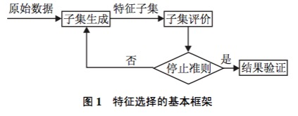
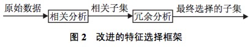
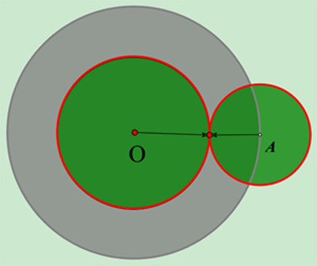

## 概念

特征选择是从一组特征中挑选出一些最有效的特征以降低特征空间维数的过程，是模式识别的关键问题之一。样本中是否含有不相关或冗余信息直接影响着分类器的性能，因此研究有效的特征选择算法至关重要。

<!---more-->

## 特征选择的框架

首先从特征全集中产生出一个特征子集，然后用评价函数对该特征子集进行评价，评价的结果与停止准则进行比较，若评价结果比停止准则好就停止，否则就继续产生下一组特征子集，继续进行特征选择。选出来的特征子集一般还要验证其有效性。

由于子集搜索是一个比较费时的步骤, 一些科研工作者基于相关和冗余分析, 给出了另一种特征选择框架, 避免了子集搜索, 可以高效快速地寻找最优子集. 框架如图 2 所示.

从特征选择的基本框架可以看出, 特征选择方法中有4个基本步骤: 候选特征子集的生成(搜索策略)、评价准则、停止准则和验证方法. 目前对特征选择方法的研究主要集中于搜索策略和评价准则, 因而, 本文从搜索策略和评价准则两个角度对特征选择方法进行分类.

## 基于搜索策略划分特征选择方法

基本的搜索策略按照特征子集的形成过程可分为以下3种: 全局最优、随机搜索和启发式搜索. 一 个具体的搜索算法会采用两种或多种基本搜索策略, 例如遗传算法是一种随机搜索算法, 同时也是一种启发式搜索算法.

### 完全搜索（全局搜索）

完全搜索分为穷举搜索(Exhaustive)与非穷举搜索(Non-Exhaustive)两类。

(1)  广度优先搜索( Breadth First Search )

算法描述：广度优先遍历特征子空间。

算法评价：枚举了所有的特征组合，属于穷举搜索，时间复杂度是O(2n)，实用性不高。

(2) 分支限界搜索( Branch and Bound )

算法描述：在穷举搜索的基础上加入分支限界。例如：若断定某些分支不可能搜索出比当前找到的最优解更优的解，则可以剪掉这些分支。

(3) 定向搜索 (Beam Search )

算法描述：首先选择N个得分最高的特征作为特征子集，将其加入一个限制最大长度的优先队列，每次从队列中取出得分最高的子集，然后穷举向该子集加入1个特征后产生的所有特征集，将这些特征集加入队列。

(4) 最优优先搜索 ( Best First Search )

算法描述：与定向搜索类似，唯一的不同点是不限制优先队列的长度。

迄今为止, 唯一得到最优结果的搜索方法是分支定界法. 这种算法能保证在事先确定优化特征子 集中特征数目的情况下, 找到相对于所设计的可分 性判据而言的最优子集. 它的搜索空间是 𝑶(2的𝑁次方) (其 中 𝑁 为特征的维数). 存在的问题: 很难确定优化特征 子集的数目; 满足单调性的可分性判据难以设计; 处理高维多类问题时, 算法的时间复杂度较高. 因此, 虽然全局最优搜索策略能得到最优解, 但因为诸多因素
限制, 无法被广泛应用.

### 启发式搜索

(1)序列前向选择( SFS , Sequential Forward Selection )

算法描述：特征子集X从空集开始，每次选择一个特征x加入特征子集X，使得特征函数J( X)最优。简单说就是，每次都选择一个使得评价函数的取值达到最优的特征加入，其实就是一种简单的贪心算法。

算法评价：缺点是只能加入特征而不能去除特征。例如：特征A完全依赖于特征B与C，可以认为如果加入了特征B与C则A就是多余的。假设序列前向选择算法首先将A加入特征集，然后又将B与C加入，那么特征子集中就包含了多余的特征A。

(2)序列后向选择( SBS , Sequential Backward Selection )

算法描述：从特征全集O开始，每次从特征集O中剔除一个特征x，使得剔除特征x后评价函数值达到最优。

算法评价：序列后向选择与序列前向选择正好相反，它的缺点是特征只能去除不能加入。

另外，SFS与SBS都属于贪心算法，容易陷入局部最优值。

(3) 双向搜索( BDS , Bidirectional Search )

算法描述：使用序列前向选择(SFS)从空集开始，同时使用序列后向选择(SBS)从全集开始搜索，当两者搜索到一个相同的特征子集C时停止搜索。

双向搜索的出发点是  。如下图所示，O点代表搜索起点，A点代表搜索目标。灰色的圆代表单向搜索可能的搜索范围，绿色的2个圆表示某次双向搜索的搜索范围，容易证明绿色的面积必定要比灰色的要小。

(4) 增L去R选择算法 ( LRS , Plus-L Minus-R Selection )

该算法有两种形式:

<1> 算法从空集开始，每轮先加入L个特征，然后从中去除R个特征，使得评价函数值最优。( L > R )

<2> 算法从全集开始，每轮先去除R个特征，然后加入L个特征，使得评价函数值最优。( L < R )

算法评价：增L去R选择算法结合了序列前向选择与序列后向选择思想， L与R的选择是算法的关键。

(5) 序列浮动选择( Sequential Floating Selection )

算法描述：序列浮动选择由增L去R选择算法发展而来，该算法与增L去R选择算法的不同之处在于：序列浮动选择的L与R不是固定的，而是“浮动”的，也就是会变化的。

序列浮动选择根据搜索方向的不同，有以下两种变种。

<1>序列浮动前向选择( SFFS , Sequential Floating Forward Selection )

算法描述：从空集开始，每轮在未选择的特征中选择一个子集x，使加入子集x后评价函数达到最优，然后在已选择的特征中选择子集z，使剔除子集z后评价函数达到最优。

<2>序列浮动后向选择( SFBS , Sequential Floating Backward Selection )

算法描述：与SFFS类似，不同之处在于SFBS是从全集开始，每轮先剔除特征，然后加入特征。

算法评价：序列浮动选择结合了序列前向选择、序列后向选择、增L去R选择的特点，并弥补了它们的缺点。

(6) 决策树( Decision Tree Method , DTM)

算法描述：在训练样本集上运行C4.5或其他决策树生成算法，待决策树充分生长后，再在树上运行剪枝算法。则最终决策树各分支处的特征就是选出来的特征子集了。决策树方法一般使用信息增益作为评价函数。

一般认为采用浮动广义后向选择方 法 (FGSBS) 是较为有利于实际应用的一种特征选择 搜索策略, 它既考虑到特征之间的统计相关性, 又用 浮动方法保证算法运行的快速稳定性. 存在的问 题是: 启发式搜索策略虽然效率高, 但是它以牺牲全局最优为代价.

### 随机搜索

(1) 随机产生序列选择算法(RGSS, Random Generation plus Sequential Selection)

算法描述：随机产生一个特征子集，然后在该子集上执行SFS与SBS算法。

算法评价：可作为SFS与SBS的补充，用于跳出局部最优值。

(2) 模拟退火算法( SA, Simulated Annealing )

模拟退火算法可参考 [大白话解析模拟退火算法](http://www.cnblogs.com/heaad/archive/2010/12/20/1911614.html)。

算法评价：模拟退火一定程度克服了序列搜索算法容易陷入局部最优值的缺点，但是若最优解的区域太小（如所谓的“高尔夫球洞”地形），则模拟退火难以求解。

(3) 遗传算法( GA,  Genetic Algorithms )

遗传算法可参考 [遗传算法入门](http://www.cnblogs.com/heaad/archive/2010/12/23/1914725.html) 。

算法描述：首先随机产生一批特征子集，并用评价函数给这些特征子集评分，然后通过交叉、突变等操作繁殖出下一代的特征子集，并且评分越高的特征子集被选中参加繁殖的概率越高。这样经过N代的繁殖和优胜劣汰后，种群中就可能产生了评价函数值最高的特征子集。

在计算过程中把特征选择问题与模拟退火算 法、禁忌搜索算法、遗传算法等, 或者仅仅是一个随 机重采样过程结合起来, 以概率推理和采样过程 作为算法的基础, 基于对分类估计的有效性, 在算法 运行中对每个特征赋予一定的权重; 然后根据用户所 定义的或自适应的阈值来对特征重要性进行评价. 当 特征所对应的权重超出了这个阈值, 它便被选中作为 重要的特征来训练分类器. Relief系列算法即是一种 典型的根据权重选择特征的随机搜索方法, 它能有效 地去掉无关特征, 但不能去除冗余, 而且只能用于两类分类

存在的问题: 具有较高的不确定性, 只有当总循
环次数较大时, 才可能找到较好的结果. 在随机搜索 策略中, 可能需对一些参数进行设置, 参数选择的合 适与否对最终结果的好坏起着很大的作用. 因此, 参 数选择是一个关键步骤.

### 总结
每种搜索策略都有各自的优缺点, 在实际应用过 程中, 可以根据具体环境和准则函数来寻找一个最佳 的平衡点. 例如, 如果特征数较少, 可采用全局最优搜 索策略; 若不要求全局最优, 但要求计算速度快, 则可 采用启发式策略; 若需要高性能的子集, 而不介意计 算时间, 则可采用随机搜索策略.

## 基于评价准则划分特征选择方法

特征选择方法依据是否独立于后续的学习算法, 可分为过滤式 (Filter) 和封装式 (Wrapper)两种. Filter与后续学习算法无关, 一般直接利用所有训练 数据的统计性能评估特征, 速度快, 但评估与后续学 习算法的性能偏差较大. Wrapper利用后续学习算法 的训练准确率评估特征子集, 偏差小, 计算量大, 不适合大数据集. 下面分别对Filter和Wrapper方法进行分析.

### 过滤式 (Filter) 评价策略的特征选择方法

Filter 特征选择方法一般使用评价准则来增强特 征与类的相关性, 削减特征之间的相关性. 可将评价 函数分成4类[5]: 距离度量、信息度量、依赖性度量以及一致性度量.

#### 距离度量

距离度量通常也认为是分离性、差异性或者辨
识能力的度量. 最为常用的一些重要距离测度[1]有 欧氏距离、𝑆 阶 Minkowski 测度、Chebychev 距离、平方距离等.

#### 信息度量
信息度量通常采用信息增益 (IG) 或互信息 (MI)
衡量. 信息增益定义为先验不确定性与期望的后验不 确定性之间的差异, 它能有效地选出关键特征, 剔除 无关特征[18]. 互信息描述的是两个随机变量之间相 互依存关系的强弱. 信息度量函数𝐽(𝑓)在Filter特征 选择方法中起着重要的作用.

#### 依赖性度量

有许多统计相关系数, 如 Pearson 相关系数、概 率误差、Fisher 分数、线性可判定分析、最小平方回 归误差、平方关联系数、𝑡-test和F-Statistic等被 用来表达特征相对于类别可分离性间的重要性程 度.

#### 一致性度量

给定两个样本, 若他们特征值均相同, 但所属类 别不同, 则称它们是不一致的; 否则, 是一致的. 一致性准则用不一致率来度量, 它不是最大化类的可分离 性, 而是试图保留原始特征的辨识能力, 即找到与全 集有同样区分类别能力的最小子集. 它具有单调、快 速、去除冗余和不相关特征、处理噪声等优点,能获 得一个较小的特征子集. 但其对噪声数据敏感, 且只 适合离散特征. 典型算法有Focus, LVF等.

上面分析了Filter方法中的一些准则函数, 选 择合适的准则函数将会得到较好的分类结果. 但 Filter 方法也存在很多问题: 它并不能保证选择出一 个优化特征子集, 尤其是当特征和分类器息息相关时. 因而, 即使能找到一个满足条件的优化子集, 它的规 模也会比较庞大, 会包含一些明显的噪声特征. 但是 它的一个明显优势在于可以很快地排除很大数量的 非关键性的噪声特征, 缩小优化特征子集搜索的规模, 计算效率高, 通用性好, 可用作特征的预筛选器.

### 封装式 (Wrapper) 评价策略的特征选择方法

除了上述 4 种准则, 分类错误率也是一种衡量所 选特征子集优劣的度量标准. Wrapper模型将特征选 择算法作为学习算法的一个组成部分, 并且直接使 用分类性能作为特征重要性程度的评价标准. 它的依 据是选择子集最终被用于构造分类模型. 因此, 若在 构造分类模型时, 直接采用那些能取得较高分类性 能的特征即可,从而获得一个分类性能较高的分类模 型. 该方法在速度上要比 Filter 方法慢, 但是它所选 择的优化特征子集的规模相对要小得多, 非常有利 于关键特征的辨识; 同时它的准确率比较高, 但泛化 能力比较差, 时间复杂度较高. 目前此类方法是特征 选择研究领域的热点,

### 总结

综上所述, Filter和Wrapper特征选择方法各有
优缺点. 将启发式搜索策略和分类器性能评价准则 相结合来评价所选的特征, 相对于使用随机搜索策 略的方法,节约了不少时间. Filter和Wrapper是两种互补的模式, 两者可以结合. 混合特征选择过程一般由两个阶段组成, 首先使用 Filter 方法初步剔除大部 分无关或噪声特征, 只保留少量特征, 从而有效地减 小后续搜索过程的规模. 第 2 阶段将剩余的特征连 同样本数据作为输入参数传递给 Wrapper 选择方法, 以进一步优化选择重要的特征.
