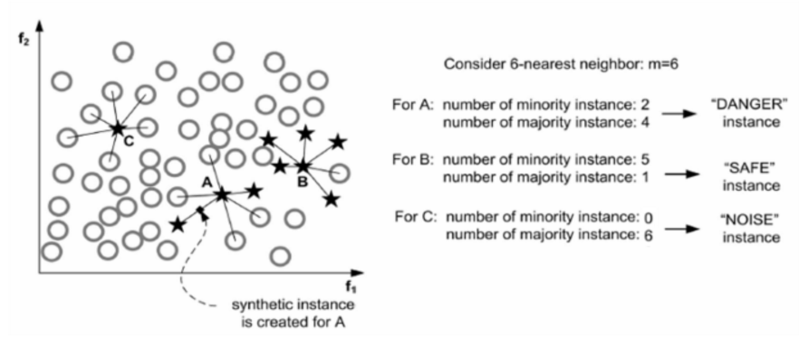
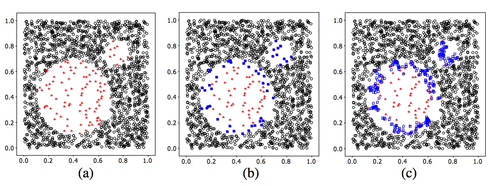
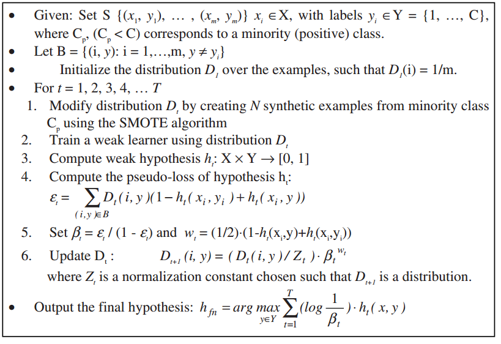
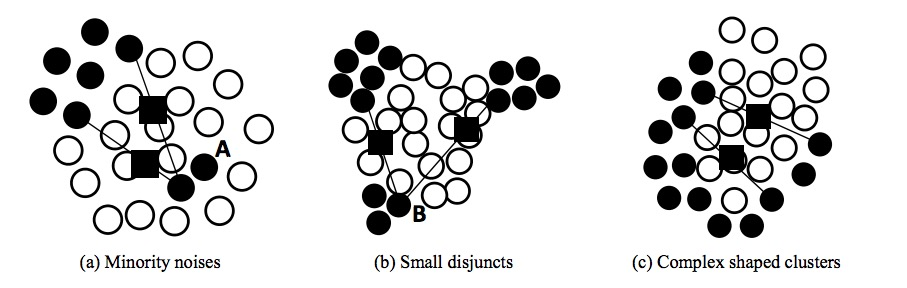
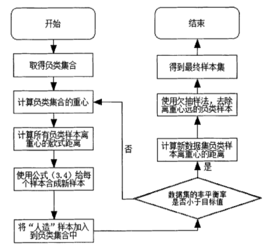
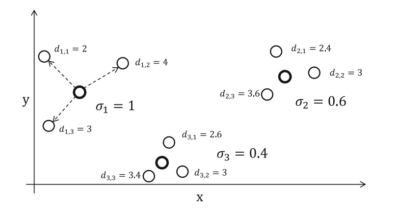
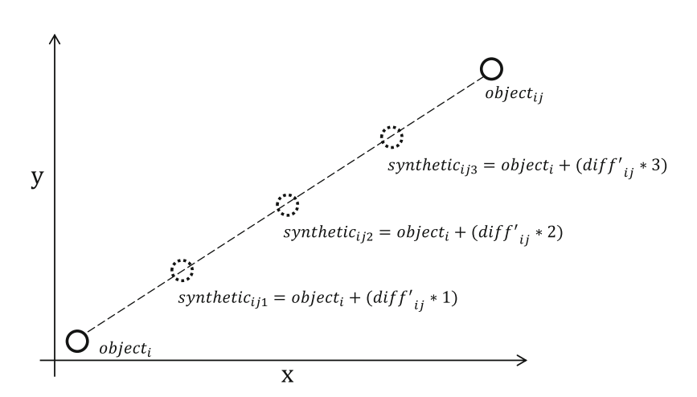
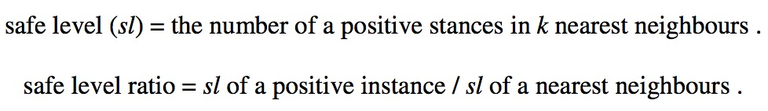
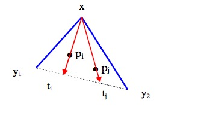

## Borderline-SMOTE：

[Borderline-SMOTE: A New Over-Sampling Method in
Imbalanced Data Sets Learning](http://download.springer.com/static/pdf/440/chp%253A10.1007%252F11538059_91.pdf?originUrl=http%3A%2F%2Flink.springer.com%2Fchapter%2F10.1007%2F11538059_91&token2=exp=1474262954~acl=%2Fstatic%2Fpdf%2F440%2Fchp%25253A10.1007%25252F11538059_91.pdf%3ForiginUrl%3Dhttp%253A%252F%252Flink.springer.com%252Fchapter%252F10.1007%252F11538059_91*~hmac=e986ed4925c2bb65d11a6d29af2369242b36abf4483e4ef2b445a6ffb3db527e)

<!---more-->

#### motivation：

有些样本远离边界，所以对分类没有多大帮助，可以强化边界点。

#### 思路：

将少数类样本根据距离多数类样本的距离分为noise,safe,danger三类样本集，只对danger中的样本集合使用smote算法。

```
For each point p in S:
    1. Compute its m nearest neighbors in T. Call this set Mp and let m'= |Mp ∩ L|.
    2. If m'= m, p is a noisy example. Ignore p and continue to the next point.
    3. If 0 ≤ m'≤m/2, p is safe. Ignore p and continue to the next point.
    4. If m/2 ≤ m'≤ m, add p to the set DANGER.
For each point d in DANGER, apply the SMOTE algorithm to generate synthetic examples.
```




## SMOTEBoost:

[SMOTEBoost: Improving Prediction
of the Minority Class in Boosting ](http://download.springer.com/static/pdf/691/chp%253A10.1007%252F978-3-540-39804-2_12.pdf?originUrl=http%3A%2F%2Flink.springer.com%2Fchapter%2F10.1007%2F978-3-540-39804-2_12&token2=exp=1474263888~acl=%2Fstatic%2Fpdf%2F691%2Fchp%25253A10.1007%25252F978-3-540-39804-2_12.pdf%3ForiginUrl%3Dhttp%253A%252F%252Flink.springer.com%252Fchapter%252F10.1007%252F978-3-540-39804-2_12*~hmac=78a012d7c1c4d5262ced873731b1dbd009f8f09b009e4bf6dd6bc8ccadcc1a79)



与集成学习相结合

## AND-SMOTE:

[Automatic Determination of Neighborhood Size in SMOTE](http://xueshu.baidu.com/s?wd=paperuri%3A%281c4637c5a6957391ec32d2795a4b00ae%29&filter=sc_long_sign&tn=SE_xueshusource_2kduw22v&sc_vurl=http%3A%2F%2Fdl.acm.org%2Fcitation.cfm%3Fid%3D2857648&ie=utf-8&sc_us=4791841824759104902)

#### motivation：

smote算法中有一个参数k，不合适的k值会导致合成的少数类样本进入多数类样本中，由此产生了噪声，妨碍分类的进行。

如下图黑色圆是少数类，白色圆是多数类，黑方框是合成的少数类。分别对应三种问题，数据中包含noises，small disjuncts,complex shaped clusters



#### 思路：

提出一种AND（Automatic Neighborhood size Determination）方法，对每个少数类产生合适的近邻样本 K=(k1,k2.....kt)，t是少数类样本的个数。然后将AND的输出作为smote算法中每个少数类样本近邻的输入。

## C_SMOTE:

[随机森林算法优化研究](http://cdmd.cnki.com.cn/Article/CDMD-11912-1014220587.htm)

#### motivation：

1、K值的选择有一定的盲目性，如何选择最优K值

2、若负类样本处于正负类的边界，则合成的新样本也有可能处于分类边缘，且越来越边缘化，边界变得模糊，加大分类难度。


#### 思路：

围绕少数类重心产生样本，C_SMOTE不需要选择K个近邻，使新产生的少数类样本向重心趋近，不会偏离出少数类的样本



## SMOTE-DGC:

[SMOTE-DGC: An Imbalanced Learning Approach of Data Gravitation Based Classification](http://download.springer.com/static/pdf/480/chp%253A10.1007%252F978-3-319-42294-7_11.pdf?originUrl=http%3A%2F%2Flink.springer.com%2Fchapter%2F10.1007%2F978-3-319-42294-7_11&token2=exp=1474267530~acl=%2Fstatic%2Fpdf%2F480%2Fchp%25253A10.1007%25252F978-3-319-42294-7_11.pdf%3ForiginUrl%3Dhttp%253A%252F%252Flink.springer.com%252Fchapter%252F10.1007%252F978-3-319-42294-7_11*~hmac=f29d5db64285215136e98232bd221b9be5f0892241c8b6d9dee9fd2df9b93aa2)

#### motivation:

针对DGC这个分类器不平衡问题提出解决方案。将smote算法和DGC分类器组合，DGC（data gravitation-based classification ）是本文作者之前做的一个分类器．

## SMOTE-D:

[SMOTE-D a Deterministic Version of SMOT](http://download.springer.com/static/pdf/261/chp%253A10.1007%252F978-3-319-39393-3_18.pdf?originUrl=http%3A%2F%2Flink.springer.com%2Fchapter%2F10.1007%2F978-3-319-39393-3_18&token2=exp=1474260388~acl=%2Fstatic%2Fpdf%2F261%2Fchp%25253A10.1007%25252F978-3-319-39393-3_18.pdf%3ForiginUrl%3Dhttp%253A%252F%252Flink.springer.com%252Fchapter%252F10.1007%252F978-3-319-39393-3_18*~hmac=8dc3af5112ee310b9330564cfe24905057082f7a3e50ca521d56a7a53183c723)

#### motivation
smote算法中每个少数类有K个近邻，再从K个样本中随机挑选m个样本用于合成样本。这就有一定的随机性，每次使用smote的时候都会产生不同的样本分布。

#### 思路
对每个少数类样本的K个近邻，计算每个少数类样本到K个近邻的距离，然后求样本标准差，计算每个样本标准差占总体少数类样本标准差的比例。如下图。



对于样本1，标准差占的比例为1/(1+0.4+0.6)=0.5,如果有10个少数类样本要生成，则样本1合成其中的5个。对于这5个样本再按照一定的方法分配给K个近邻，其中近邻距离越长，合成的样本越多。



## Safe-Level-SMOTE

[Safe-Level-SMOTE](http://sci2s.ugr.es/keel/pdf/algorithm/congreso/2009-Bunkhumpornpat-LNCS.pdf)

#### motivation

smote盲目生成少数类的区域，导致少数类的样本区域变得更大，决策边界也变得更加不明确。所以要有控制的生成样本。

#### 思路

对于每个少数类样本p，计算它的最近邻K个样本，从K个样本中随机选择一个样本n,记p的K个最近邻和n的K个最近邻为slp和sln，safe level ratio就是slp和sln的比率，通过比率调节生成的样本是靠近p还是靠近n



## Random-SMOTE

[A new over-sampling approach: Random-SMOTE for learning from imbalanced data sets](http://xueshu.baidu.com/s?wd=paperuri%3A%28645c06973146de3442a8e88e18c1ac55%29&filter=sc_long_sign&tn=SE_xueshusource_2kduw22v&sc_vurl=http%3A%2F%2Fdl.acm.org%2Fcitation.cfm%3Fid%3D2186664&ie=utf-8&sc_us=14984370303045838996)

#### motivation
SMOTE方法只是在相邻近的小类样本之间线性插值,插值
的结果是小类样本密集的地方依然相对密集,小类样本稀疏的地方依然相对稀疏。这样,
处在稀疏区域的样本,分类算法不易识别,容易出现误分。因此,SMOTE对某些处在
稀疏区域的未知小类样本的分类效果将不明显。
#### 思路
对于每个少数类样本x，从少数类集合中随机选择两个样本y<sub>1</sub>和y<sub>2</sub>,以x、y<sub>1</sub>、y<sub>2</sub>为顶点构成一个三角形区域;根据过采样倍率N,在该三角形区域内随机生成N个新的少数类样本。


